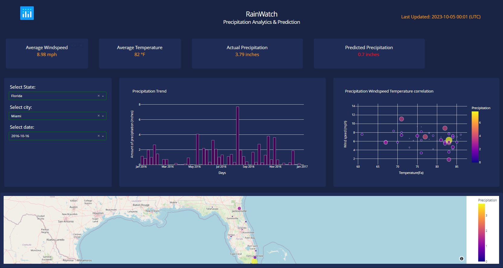
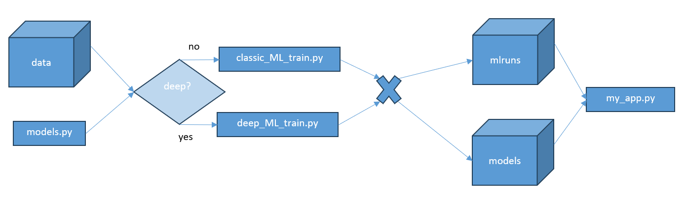
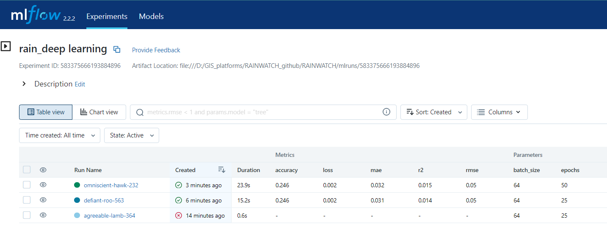

# RAINWATCH : Rainfall analytics and prediction end to end ML project
## Project goal 
The project showcases data science skills and technologies that can help monitor and predict volatile natural variables. Here we use python to build the back and front ends of a **simple web app for rainfall analytics and prediction** in the United States.
 
## Machine learning aspects  
The  machine learning aspects conducted with MLflow, sklearn and keras library.

### A. Set Up
We will setup a **conda environment** named rainenv for example with python 3.9 version
```conda create --name rainenv python=3.9``` 
 Then we install via pip libraries such as pandas, numpy , dash, mlflow, tensorflow and sklearn etc . The requirements.txt file in this repository gives the complete list of set up requirements.

### B. Data

The data has **natural dependent variables** like wind speed, wind direction, average temperature. The independent variable we want to **forecast is the level of precipitation in inches on a given date**. 

### C. Understanding the prediction problem 
**Time series data is data collected on the same subject at different points in time**. Time Series Forecasting real use case examples : 
* The Dow Jones Industrial Average index prices
* The temperature in New York City
* The unemployment rate in the USA
* Website traffic through time and similar

Time series forecasting can be univariate or multivariate. The methods used can be classic statitics like ARIMA and SARIMA or Machine learning methods like XGBoost, Random Forest or RNN, LSTM tec...

### D. Training models
Use the training scripts in the root folder. With **classic_ML_train.py** you have options of non deep learning models like linear regression, XGBRegressor  etc... The **deep_ML_train.py** presents different architectures of neural networks. All models are imported to the training scripts. Afterwards, training models are saved in pickle format 
in **models** format
  


### E. Monitoring training runs with MLflow Tracking

The experiment starts when we define MLflow context with **mlflow.start_run()**. An experiment contains multiple runs ; each with different parameters. The *autolog* function logs all parameters so it is not necessary to explicitly log parameters. 
The **experiment runs** are available to be analysed and compared via the following command from the root folder:

``` mlflow ui ``` <br>
Here is an example of a preview with a custom choice of parameters :



### F.  Methods and concepts specific to time series

####  Naive Methods 
Naive Methods such as assuming the predicted value at time ‘t’ to be the actual value of the variable at time ‘t-1’ or rolling mean of series, are used to weigh how well do the statistical models and machine learning models can perform and emphasize their need.

We are interested in the mean of the  feature of interest and the deviation around it. It is also useful to see maximum and minimum temperature values. We can use the functionalities of np library here.

#### Autoregression 
Autoregression is a time series model that uses observations from previous time steps as input to a regression equation to predict the value at the next time step. It is a very simple idea that can result in accurate forecasts on a range of time series problems. 

#### ARIMA 
A combination of autoregression and moving average models. 

#### LSTM 

It is a class of neural networks tailored to deal with temporal data. The neurons of RNN have a cell state/memory, and input is processed according to this internal state, which is achieved with the help of loops with in the neural network. There are recurring module(s) of ‘tanh’ layers in RNNs that allow them to retain information. However, not for a long time, which is why we need LSTM models.

LSTM is special kind of recurrent neural network that is capable of learning long term dependencies in data. This is achieved because the recurring module of the model has a combination of four layers interacting with each other.

### G.  Python libraries specific to time series

#### Prophet

#### Darts

#### Pycaret